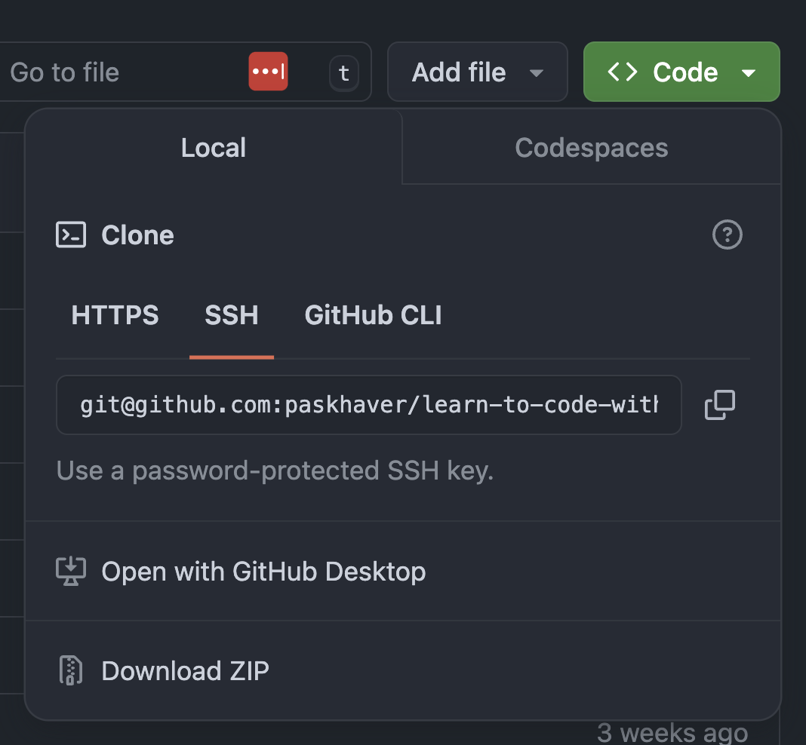
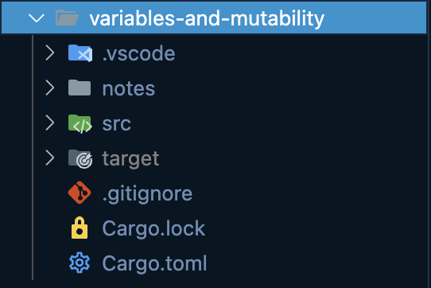
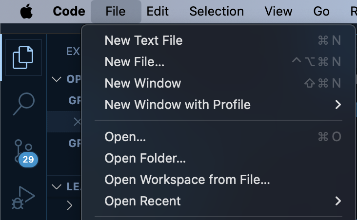

# Learn to Code with Rust


Welcome! These are the course materials for the **Learn to Code with Rust** course.

To download the content, you can either clone this repository with Git or download the repository manually. A repository (or repo) is a technical term for a project managed by Git.

### To clone repository with Git:

In Terminal/PowerShell, navigate to the directory where you'd like to download the `learn-to-code-with-rust` course materials. 

Execute `git clone git@github.com:paskhaver/learn-to-code-with-rust.git` to clone the repository to your computer.

### To download repository:

On this GitHub page, click the green `Code` button, then select "Download ZIP". Unpack the zip and move the `learn-to-code-with-rust` directory to wherever you'd like.



## Working Through the Course

The `learn-to-code-with-rust` folder contains multiple directories. Each folder is an independent Cargo project with a  `Cargo.toml` file.

At the start of each course section, you'll find a note listing the Cargo project for that course.

For example, the next section is called "Variables and Mutability" and has a corresponding `variables-and-mutability` folder.



Open up the section's folder in VSCode. There are two ways to accomplish this:

- In VSCode, access the main menu. Select `File > Open Folder...`. Locate the section's project folder on your file system and select it.



- In Terminal/PowerShell, navigate into the section's folder with the `cd` command. Then, open the folder in VSCode with `code .`

```sh
$ cd variables-and-mutability

$ code .
```
